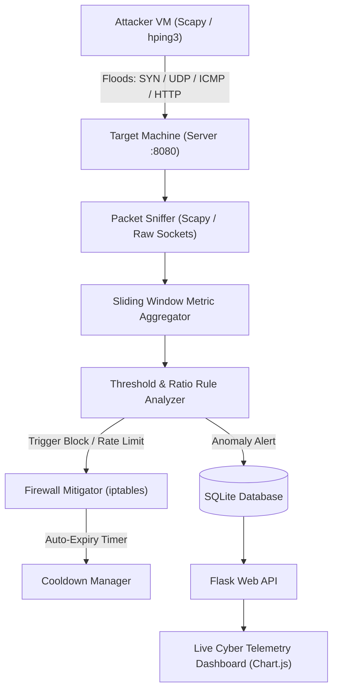

# IT307 Integrated Project: DDoS Attack Detection & Mitigation System

A modular, real-time Network Intrusion Detection & Automated Firewall Defense System built for **IT307 (Network Security & Protocols)**.

---

## Architecture Overview



---

## Project Directory Structure

```text
ddos_project/
|-- config.py                 # Thresholds, interfaces, and port configurations
|-- database.py               # SQLite logger for traffic, alerts, and firewall rules
|-- run_system.py             # Unified runner (Sniffer + Mitigator + Dashboard)
|-- requirements.txt          # Python dependencies (scapy, flask, requests)
|-- simulator/                # Controlled Attack Generators
|   |-- syn_flood.py          # Layer 4 TCP SYN flood (half-open connection)
|   |-- udp_flood.py          # Layer 4 UDP random port flood
|   |-- icmp_flood.py         # Layer 3 ICMP ping flood
|   |-- http_flood.py         # Layer 7 HTTP GET/POST concurrency flood
|   \-- attack_cli.py         # Unified interactive CLI attack launcher
|-- detection/                # Traffic Capture & Rule Classifier
|   |-- packet_sniffer.py     # Protocol parser & rate accumulator
|   |-- analyzer.py           # Anomaly rules (PPS, SYN:SYN-ACK ratio, Spike detection)
|   \-- detector.py           # Detection worker loop
|-- mitigation/               # Automated Countermeasures
|   |-- firewall.py           # iptables controller (DROP / Rate limit / Mock mode)
|   \-- cooldown_manager.py   # Automatic expiration and unblocking thread
\-- dashboard/                # Real-Time Web Console
    |-- app.py                # Flask API routes
    |-- templates/index.html  # Dark cybersecurity UI layout
    \-- static/
        |-- style.css         # Glassmorphic cyber theme
        \-- dashboard.js      # Chart.js live telemetry updater
```

---

## Quickstart & Execution Guide

### 1. Install Dependencies
```bash
pip install -r requirements.txt
```

### 2. Start Defense Controller (Target Machine)
On the target server / VM (run as administrator or `sudo` on Linux):
```bash
python run_system.py
```
* The Web Dashboard will start immediately at: `http://localhost:8080`

### 3. Launch Controlled Test Attacks
From the Attacker terminal or VM:

* **SYN Flood (TCP Handshake Attack):**
  ```bash
  python -m simulator.attack_cli --type syn --target 127.0.0.1 --port 8080 --count 400
  ```

* **UDP Flood (Volumetric Bandwidth Attack):**
  ```bash
  python -m simulator.attack_cli --type udp --target 127.0.0.1 --count 400
  ```

* **ICMP Ping Flood:**
  ```bash
  python -m simulator.attack_cli --type icmp --target 127.0.0.1 --count 300
  ```

* **HTTP Layer 7 Flood:**
  ```bash
  python -m simulator.attack_cli --type http --target 127.0.0.1 --port 8080 --count 500 --threads 20
  ```

---

## Syllabus Mapping (IT307)

| Module | Core Concepts Demonstrated in this Project |
|---|---|
| **Module II (Protocols & Communications)** | Baseline protocol behavior; RFC standard packet formats for IP, TCP, UDP, ICMP. |
| **Module III (Ethernet & Switching)** | Packet-level frame analysis, MAC/IP association, promiscuous capture. |
| **Module IV (Transport Layer - TCP/UDP)** | TCP 3-way handshake exhaustion (SYN vs SYN-ACK ratio), connectionless UDP socket flooding. |
| **Module V (Network Security Fundamentals)** | Real-time anomaly detection, rate limiting, automated Linux `iptables` defense & rule lifecycles. |

---

 Hard `DROP` blocks critical malicious floods immediately.
3. **Why is an Auto-Expiry Cooldown essential?**
   * *Answer:* IP spoofing or dynamic IP reallocation (DHCP) means permanent bans would eventually block legitimate users. A 60-second cooldown ensures defensive agility.
